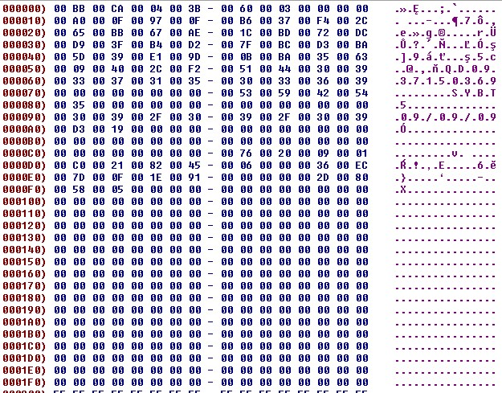
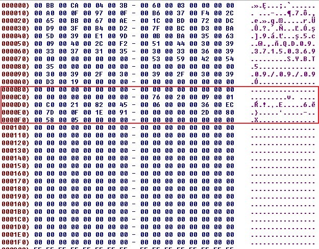
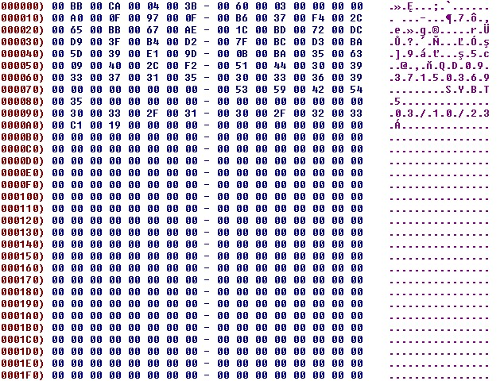
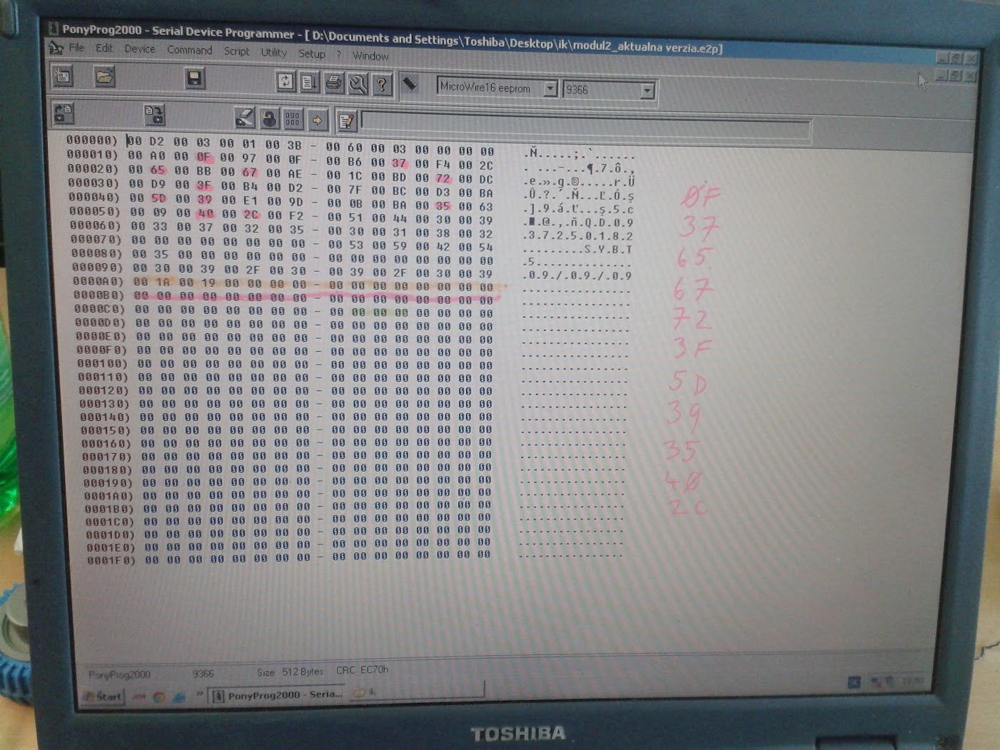
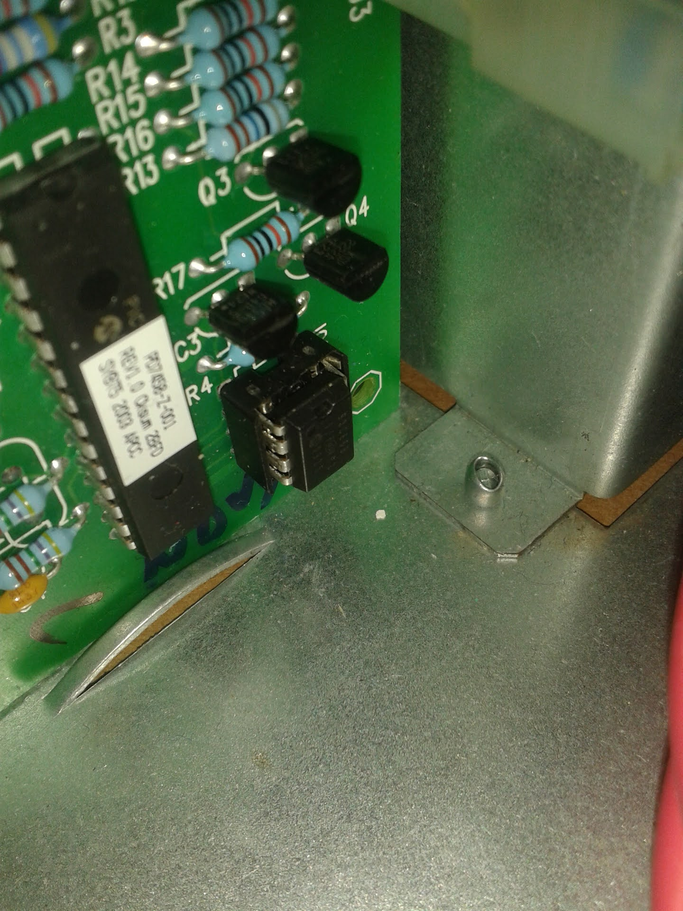
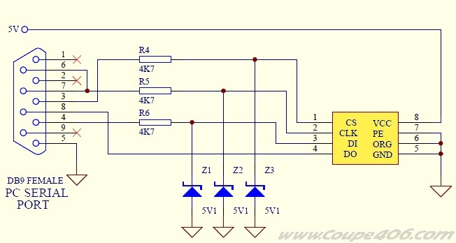
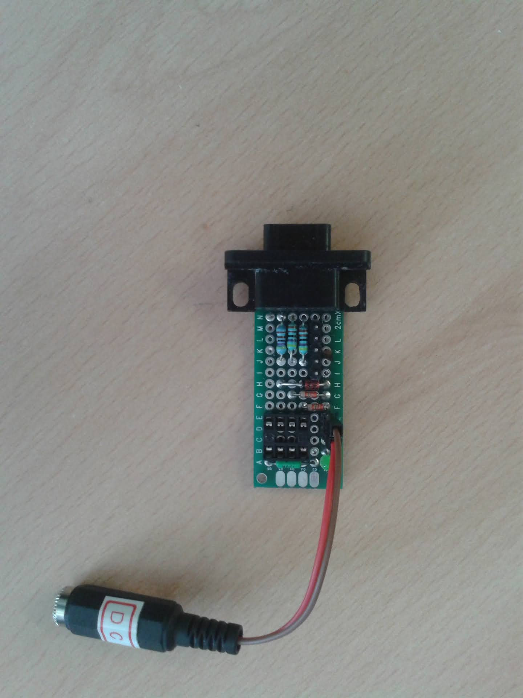
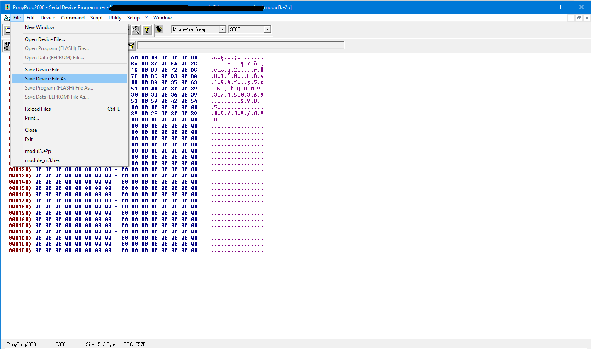
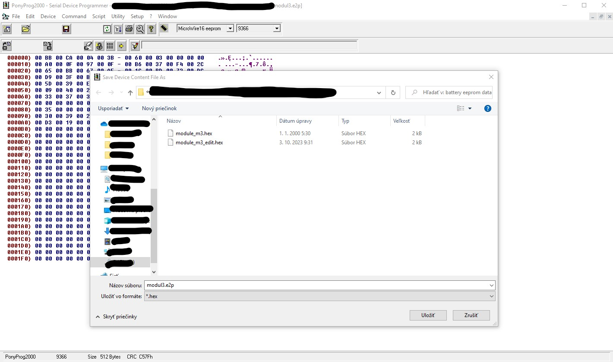

# Modification EEPROM data for APC SYMETRA SYBT5 battery pack

This is manual how to hack APC Symmetra SYBT5 battery module

## Script 
Here is a simple python script sysbt5_calculator.py for modification of EEPROM data in the battery pack SYBT5. I used python 3.9

Script is very simple. As input is necessary file in the INTEL HEX format and new manufactured date. Optional variable is new serial number.

For example with modification just date
```
python3.9 checksum_file.py battery.hex 26/09/23
```
Where **26/09/23** is date in the format DD/MM/YY.

Example for modification date and serial number
```
python3.9 checksum_file.py battery.hex 26/09/23 QD0937150369
```
Where **QD0937150369** is new serial number.

Script automatically calculate checksum, and removed last data with calibration values, failure values and more.  These data are not required. The UPS generates them by itself after starting the calibration of the battery module. 

## EEPROM DATA

In the next picture is shown original data



Calibration data are stored in the following image in the red box



And next picture show output data from script with new manufacture date



Here is picture how must looks output data



In the orange line is checksum for data with SN, manufacturer data, module parameterization... so all data before the orange line are static data with information about the battery module.

Behind the pink line are the calibration data that the UPS stores in the EEPROM memory. This data needs to be deleted. In this example, they have already been deleted

It is good to check whether the cells highlighted in pink match the data written in the table. As it looks in the previous picture

## HW
Type of the EEPROM memory is 93C66B. It's standard 8 pin EEPROM memory from Microchip company.

In the standard situation is the EEPROM soldering to PCB board. For future is better use 8 pin socket for connecting EEPROM to PCB board as you can see on the picture



For reading and write data to/from EEPROM I used RS232 programmers



Here is my simple construction


It is neccesary use external 5V for programmer power supply. 

## Read/Write EEPROM 
For reading and write data to EEPROM memory I used [PonyProg SW](http://www.lancos.com/prog.html)

File is neccesary save as HEX. So go to **file -> Save device file As...**


Select **.hex file** and save


## APC SYMETRA UPS

For check battery status go to **1- Device manager -> 1- Symetra LX 16000 RM -> 6- Module Diagnostics & Information -> SELECT FRAME -> 4- Battery Status**

For check battery module information **1- Device manager -> 1- Symetra LX 16000 RM -> 6- Module Diagnostics & Information -> SELECT FRAME -> 5- Battery module info**
